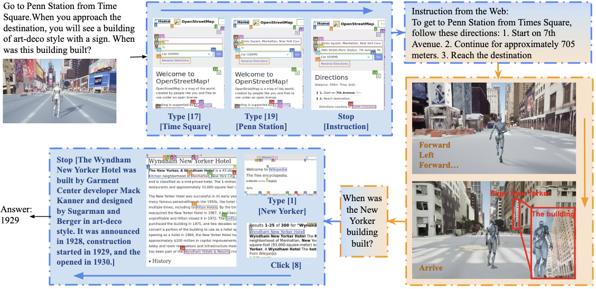

# EMBODIED WEB AGENTS: Bridging Physical-Digital Realms for Integrated Agent Intelligence
<!-- <p align="center">
<a href="https://www.python.org/downloads/release/python-3109/"></a>
<a href="https://pre-commit.com/"></a>
<a href="https://github.com/psf/black"></a>
<a href="https://mypy-lang.org/"></a>
<a href="https://beartype.readthedocs.io"></a>
</p> -->

[<a href="http://98.80.38.242:1220/">Benchmark Web Environment</a>] 
[<a href="https://arxiv.org/abs/2401.13649">Paper</a>]
[<a href="https://embodied-web-agent.github.io">Homepage</a>] 

We introduce Embodied Web Agents, a novel paradigm for AI agents that fluidly bridge embodiment and web-scale reasoning. 
To operationalize this concept, we first develop the Embodied Web Agents task environments, a unified simulation platform that integrates realistic 3D indoor and outdoor environments with functional web interfaces. Building upon this platform, we construct and release the Embodied Web Agents Benchmark, which encompasses a diverse suite of tasks including cooking, navigation, shopping, tourism, and geolocation guessing — all requiring coordinated reasoning across physical and digital realms for systematic assessment of cross-domain intelligence.



## Web Environment
Our website is hosted at [<a href="http://98.80.38.242:1220/">here</a>]. However, you may choose to host the website by yourself. You can find very detailed instructions [<a href="https://github.com/Embodied-Web-Agent/Embodied-Web-Agent/tree/main/web_enviroments">Here</a>]
```
cd web_enviroments
bash build.sh
bash host.sh
```

