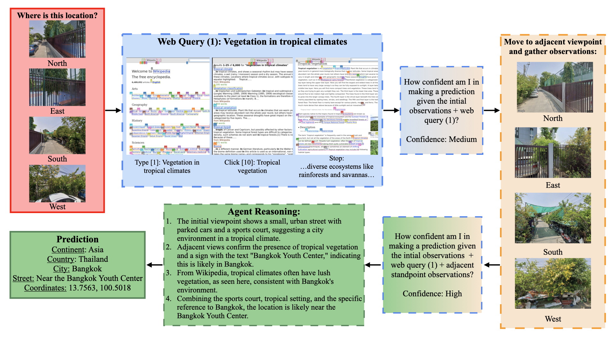

# Geolocation Task
Welcome to our geolocation task, based on the popular online game GeoGuessr. 

The goal of this task is to evaluate a VLM's ability to determine the coordinates (latitude, longitude) and continent, country, city, and street of a particular location sampled from the Breadth dataset introduced in the VLMs as GeoGuessr Masters paper (Huang et al.). 

However, instead of only providing the model with a single image, we allow the model to move from the initial viewpoint to adjacent viewpoints using the Google Street View API—just like how you're able to move along a street in GeoGuessr to explore the location. 

Additionally, we provide our model with web access (Wikipedia) via VisualWebArena and make queries to enhance its predictions (Koh et al.).



# Baseline
## Setting up the Repository
1. Clone our repository:
    ```
    git clone https://github.com/Embodied-Web-Agent/Embodied-Web-Agent.git
    cd Embodied-Web-Agent
    ```

2. Navigate to the `geolocation` directory in `Emboied-Web-Agent/models/`:
    ```
    cd models/geolocation
    ```

3.  Create a `python 3.10` or `python 3.11` virtual environment:
- With `conda`:
    ```
    conda create -n geo python=3.11
    conda activate geo
    ```
- With `venv`:
    ```
    python3.11 -m venv venv
    source venv/bin/activate
    ```

4. Install required packages:
    ```
    pip install -r requirements.txt
    ```

5. Create a `.env` file containing the following:
- The Google API key is for using the Google Street View API (REQUIRED)
- You only need to include keys for the models you want to use
    ```
    GOOGLE_API_KEY="your_key_here"
    OPENAI_API_KEY="<your_key_here>"
    GEMINI_API_KEY="<your_key_here>"
    QWEN_API_KEY="<your_key_here>"
    ```

## Setting up the Data
You can either use our curated Hugging Face dataset (142 samples) that we used in our paper, or you can directly use the entire Breadth dataset from the FairLocator paper that we draw from.

### Hugging Face Dataset
You don't need to do anything since our scripts automatically load in the dataset from Hugging Face.

### Entire Breadth Dataset
1. Create a new folder named `data_source` in the `geolocation` directory.
    ```
    mkdir data_source
    cd data_source
    ```

2. Download `Breadth.xlsx` into `data_source` from the [FairLocator](https://github.com/limenlp/FairLocator) repository.
- You can either run the following:
    ```
    wget https://raw.githubusercontent.com/limenlp/FairLocator/main/SourceData/Breadth.xlsx
    ```
- OR manually download it from [here](https://github.com/limenlp/FairLocator/blob/main/SourceData/Breadth.xlsx).

3. Return to the `geolocation` directory:
    ```
    cd ..
    ```

## Running the Baseline
You can now run `baseline.py` with the following flags:
- `--model_family`: your model API of choice 
    - Default: gpt
    - Choices: gpt, gemini, qwen
- `--num_samples`: how many samples you want to evaluate
    - *You only need this if you decide to store the dataset locally, otherwise ignore this*
    - Default: 200
    - Max: 600
- `--output_dir`: folder to store outputs of runs
    - Default: "baseline_views"
    - Outputs will be stored under `<output_dir>/<model_family>/<run_timestamp>`
- `--data`: where you want to source your data from
    - Default: filtered
    - Choices: filtered, breadth
        - 'filtered' will use the Hugging Face dataset
        - 'breadth' will use the local dataset
```
python baseline.py
```

# Multiple Viewpoints + Web Interactions
## Setting Up the Repository
1. Clone our forked version of `VisualWebArena (VWA)` in the directory containing the `Embodied-Web-Agent` repository
    ```
    git clone https://github.com/alchien22/visualwebarena.git
    ```
2. Follow the `VWA` setup directions outlined below:
- Use the same virtual environment from the baseline, or follow the instructions from the baseline section to create one if you haven't already. Then run the following:
    ```
    cd visualwebarena
    pip install -r requirements.txt
    playwright install
    pip install -e .
    ```

3. Since some of the package requirements in VWA are outdated, run the following as well:
    ```
    pip install --upgrade "transformers>=4.46.0" "tokenizers>=0.19,<0.22" "huggingface-hub>=0.30.2"

    # Upgrade torch according to your CUDA version, found using 'nvidia-smi' (e.g. cu124 for CUDA version 12.4)
    pip install --upgrade torch --index-url https://download.pytorch.org/whl/<your_cuda_version>

    pip install --upgrade tiktoken
    ```

4. Set the following environment variables:
    ```
    export OPENAI_API_KEY="<your_openai_api_key>"
    export DATASET=visualwebarena
    export CLASSIFIEDS="http://98.80.38.242:9980"
    export CLASSIFIEDS_RESET_TOKEN="4b61655535e7ed388f0d40a93600254c"
    export SHOPPING="http://98.80.38.242:7770"
    export REDDIT="http://98.80.38.242:9999"
    export WIKIPEDIA="http://98.80.38.242:8888/wikipedia_en_all_maxi_2022-05/A/User:The_other_Kiwix_guy/Landing"
    export HOMEPAGE="http://98.80.38.242:1220"
    export SHOPPING_ADMIN="http://98.80.38.242:7780/admin"
    export GITLAB="http://98.80.38.242:8023"
    export MAP="http://98.80.38.242:3000"
    export STORE="http://98.80.38.242:1207/"
    ```

5. Return to the `geolocation` directory in `Embodied-Web-Agent`:
    ```
    cd ../Embodied-Web-Agent/models/geolocation
    ```

## Running the Pipeline
You can now test our full pipeline using `run.py` with the following optional flags:
- `--model_family`: your model API of choice 
    - Default: gpt
    - Choices: gpt, gemini, qwen
- `--num_samples`: how many samples you want to evaluate
    - *You only need this if you decide to store the dataset locally, otherwise ignore this*
    - Default: 200
    - Max: 600
- `--output_dir`: folder to store outputs of runs
    - Default: "interactive_views"
    - Outputs will be stored under `<output_dir>/<model_family>/<run_timestamp>`
- `--run_forced`: whether or not you want force web interactions for initial viewpoints
    - Default: True
    - Choices: True, False
        - True: Requires a web query on the initial observations
        - False: Allows immediate confidence estimate after gathering initial observations
- `--data`: where you want to source your data from
    - Default: filtered
    - Choices: filtered, breadth
        - 'filtered' will use the Hugging Face dataset
        - 'breadth' will use the local dataset
```
python run.py
```

# Visualize Your Results
You can use `Streamlit` to help visualize your results:
```
streamlit run visualization.py
```

# Data Analysis
You can also check the statistics of a run:
- Continent accuracy
- Country accuracy
- City accuracy
- Street accuracy
- All accuracy
    - Accuracy of predicting the entire location (continent, country, city, and street) correctly

To do so, run `analysis.py` with the following flags:
- `--input_dir`: the directory of your run
    - `<output_dir>/<model_family>/<run_timestamp>`
- `--exclude_ids`: comma-separated list of standpoint_ids you want to exclude from the analysis
    - E.g. --exclude_ids 375,407

```
python analysis.py --input_dir <run_output_dir>
```

# Acknowledgements
We use the Breadth dataset from [FairLocator](https://github.com/limenlp/FairLocator) and the web environment from [VisualWebArena](https://github.com/web-arena-x/visualwebarena?tab=readme-ov-file). 